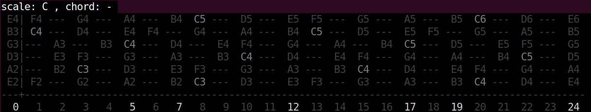
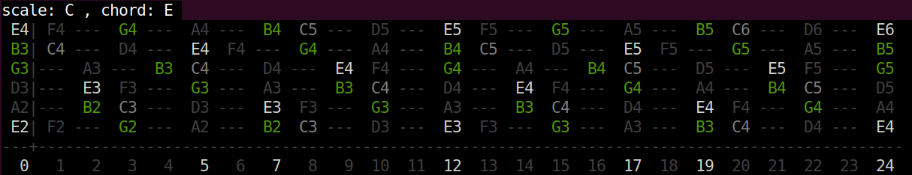
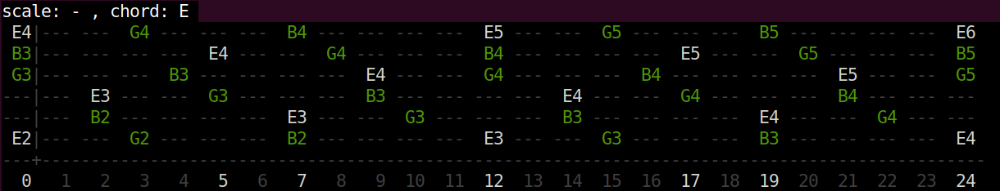
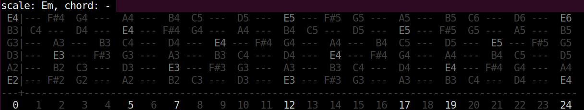
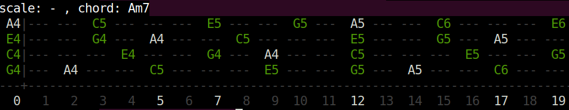
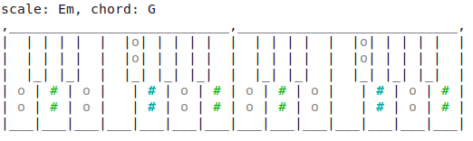

----------------------------------------------------------------------
Fretboard - Copyright 2019 Tommaso Cucinotta
----------------------------------------------------------------------
Learning notes, scales and chords of a guitar fretboard on a colorful
ANSI terminal.


----------------------------------------------------------------------
USAGE
----------------------------------------------------------------------

```
$ ./fretboard -h
Usage: fretboard [-h|--help] [-u|--ukulele] [-p|--piano] [-c|--chord [A..G][#|b][m|M]] [-s|--scale [A..G][#|b][m|M]]
```

Example 1: display all notes of the C major scale:

```
$ ./fretboard --scale C
```



As you can see, the scale root note is highlighted in a brighter grey.


Example 2: display all notes of the Em chord, along with the notes of
the C major scale:

```
$ ./fretboard --scale C --chord Em
```



As you can see, the chord notes are displayed in green, and the chord root
note is highlighted in white.

You can also visualize only the notes belonging to a given chord.

Example 3: display only the notes of the Em chord.
```
$ ./fretboard -c Em
```



If your terminal doesn't support colors, you might get something
simpler, still useful nonetheless:

Example 3: display all notes of the natural E minor scale:

```
$ ./fretboard -s Em
```
```
scale: Em, chord: - 
 E4|--- F#4  G4 ---  A4 ---  B4  C5 ---  D5 ---  E5 --- F#5  G5 ---  A5 ---  B5  C6 ---  D6 ---  E6 
 B3| C4 ---  D4 ---  E4 --- F#4  G4 ---  A4 ---  B4  C5 ---  D5 ---  E5 --- F#5  G5 ---  A5 ---  B5 
 G3|---  A3 ---  B3  C4 ---  D4 ---  E4 --- F#4  G4 ---  A4 ---  B4  C5 ---  D5 ---  E5 --- F#5  G5 
 D3|---  E3 --- F#3  G3 ---  A3 ---  B3  C4 ---  D4 ---  E4 --- F#4  G4 ---  A4 ---  B4  C5 ---  D5 
 A2|---  B2  C3 ---  D3 ---  E3 --- F#3  G3 ---  A3 ---  B3  C4 ---  D4 ---  E4 --- F#4  G4 ---  A4 
 E2|--- F#2  G2 ---  A2 ---  B2  C3 ---  D3 ---  E3 --- F#3  G3 ---  A3 ---  B3  C4 ---  D4 ---  E4 
---+------------------------------------------------------------------------------------------------
  0   1   2   3   4   5   6   7   8   9  10  11  12  13  14  15  16  17  18  19  20  21  22  23  24 
```

whereas the fully coloured version looks like this:



Example 4: display the notes of the Am7 chord for Ukulele:

```
$ ./fretboard -u -c Am7
```



Example 5: display all notes of the natural E minor scale on a piano:
```
$ ./fretboard -p -s Em
```
```
scale: Em, chord: -
,___________________________,___________________________, 
|  | | | |  |  |o| | | | |  |  | | | |  |  |o| | | | |  | 
|  | | | |  |  |o| | | | |  |  | | | |  |  |o| | | | |  | 
|  |_| |_|  |  |_| |_| |_|  |  |_| |_|  |  |_| |_| |_|  | 
| o | o | o |   | o | o | o | o | o | o |   | o | o | o | 
| o | o | o |   | o | o | o | o | o | o |   | o | o | o | 
|___|___|___|___|___|___|___|___|___|___|___|___|___|___|
```


Example 6: display all notes of the D major chord on a piano:
```
$ ./fretboard -p -c D
```


Example 7: display all notes of the G chord on the natural E minor scale on a piano:
```
$ ./fretboard -p -s Em -c G
```



----------------------------------------------------------------------
COMPILE
----------------------------------------------------------------------

Just type
```
make
```
or, equivalently
```
gcc -o fretboard fretboard.c
```


----------------------------------------------------------------------
LICENSE
----------------------------------------------------------------------

This program is free software: you can redistribute it and/or modify
it under the terms of the GNU General Public License as published by
the Free Software Foundation, either version 3 of the License, or
(at your option) any later version.

This program is distributed in the hope that it will be useful,
but WITHOUT ANY WARRANTY; without even the implied warranty of
MERCHANTABILITY or FITNESS FOR A PARTICULAR PURPOSE.  See the
GNU General Public License for more details.

You should have received a copy of the GNU General Public License
along with this program, in the LICENSE.txt file.  If not, see
<https://www.gnu.org/licenses/>.
